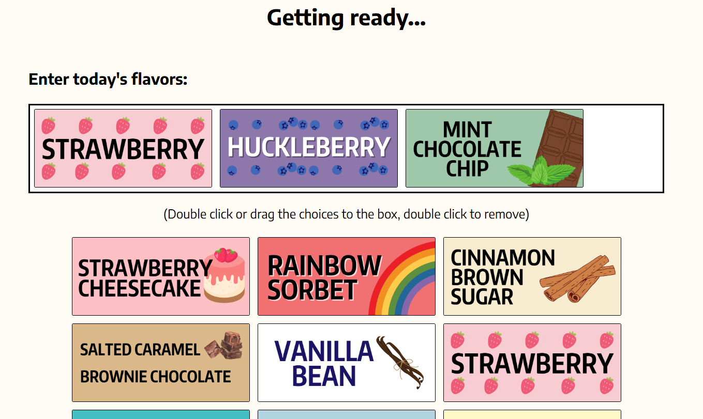
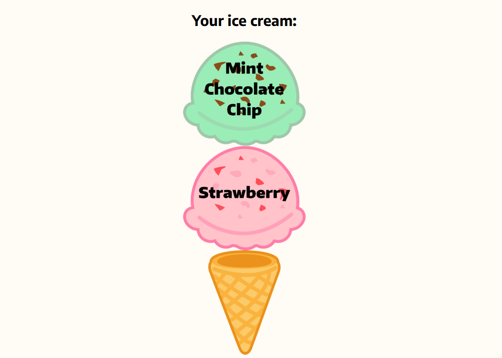

# Random Ice Cream Generator (Frontend)

A simple JavaScript-based webpage that randomly generates ice cream flavors based on selected flavors (today's flavor).\
Original built as part of a web development course project to practice DOM manipulation, event handling, and basic UI design.\
Inspired by my experience working at Frost Bite, a volunteer-based ice cream shop at UW. 

## Features
- **Select today's flavor** by dragging or double-clicking menu tags 
- **Choose your serving size** for different number of scoops
- **One click** to get your result instantly

## Programing Languages
- HTML
- CSS
- JavaScript

## Try It Now!
[Go to page here (copy and paste in new tab to open seperately)](https://yvonne-wang-82.github.io/random-ic-generator-frontend/)

## Screenshots

  
  

